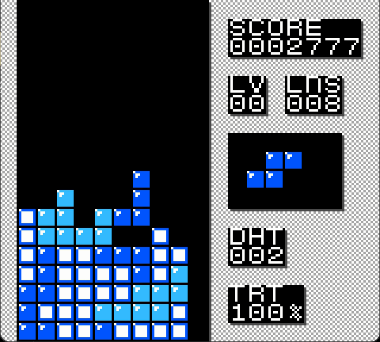

# Nestris GBC

## Introduction

This is a Game Boy Color game inspired by NES Tetris.

The code logic is mainly based on this game: [Classic Picotris](https://www.lexaloffle.com/bbs/?tid=54663).

The playfield height is 18 cells, similar to Tetris DX.

## To Do

Finish the incomplete background music.

## Build Instructions

Download [gbdk-2020](https://github.com/gbdk-2020/gbdk-2020), place this project folder under `gbdk\examples\gb\`, and then run `make.bat`.

The generated `Nestris-GBC.gbc` file will be located in the `nestris_gbc\` directory.

## Modifying Background Assets

Open and edit `nestris_gbc\others\LibreSprite\background.ase` with [LibreSprite](https://libresprite.github.io/#!/), export it, and overwrite `nestris_gbc\gfx\background.png`.

Then run the following command in the `nestris_gbc\gfx\` directory and rebuild the game:

```powershell
.\png2asset.exe background.png -o background.c -map -keep_palette_order -tile_origin 3
```

## Modifying Tetromino Assets

Open and edit `nestris_gbc\others\LibreSprite\tetromino.ase` with [LibreSprite](https://libresprite.github.io/#!/), export it, and overwrite `nestris_gbc\gfx\tetromino.png`.

Then run the following command in the `nestris_gbc\gfx\` directory and rebuild the game:

```powershell
.\png2asset.exe tetromino.png -o tetromino.c -keep_palette_order -spr8x8
```

## Modifying the Font

Open and edit `nestris_gbc\others\LibreSprite\tetromino.ase` with [LibreSprite](https://libresprite.github.io/#!/), export it, and overwrite `nestris_gbc\gfx\font.png`.

Then run the following command in the `nestris_gbc\gfx\` directory:

```powershell
.\png2asset.exe font.png -o font_tmp.c -keep_palette_order
```

Use the values from `font_tmp_tiles[1536]` in `nestris_gbc\gfx\font_tmp.c` to overwrite the values in `font_tiles[1536]` in `nestris_gbc\gfx\font.c`. Then delete `nestris_gbc\gfx\font_tmp.c` and `nestris_gbc\gfx\font_tmp.h`.

## Modifying Sound Effects

Sound effects are made with `nestris_gbc\others\CBT-FX\hammered.gb`. See [CBT-FX/FX-Hammer-Guide](https://github.com/coffeevalenbat/CBT-FX/blob/main/FX-Hammer-Guide.md#getting-started) for usage instructions.

After making changes, run the corresponding commands in the `nestris_gbc\others\CBT-FX\` directory, then rebuild the game:

```powershell
python hammer2cbt_chain.py hammered.sav 0x0A ../../snd/ --fxchain 0x0A,0x0B --fxchain-name SFX_LINECLEAR
python hammer2cbt_chain.py hammered.sav 0x0C ../../snd/ --fxchain 0x0C --fxchain-name SFX_SELECT
python hammer2cbt_chain.py hammered.sav 0x0D ../../snd/ --fxchain 0x0D --fxchain-name SFX_MOVE
python hammer2cbt_chain.py hammered.sav 0x0E ../../snd/ --fxchain 0x0E --fxchain-name SFX_ROTATE
python hammer2cbt_chain.py hammered.sav 0x0F ../../snd/ --fxchain 0x0F --fxchain-name SFX_LEVELUP
python hammer2cbt_chain.py hammered.sav 0x10 ../../snd/ --fxchain 0x10 --fxchain-name SFX_TETRIS
python hammer2cbt_chain.py hammered.sav 0x3B ../../snd/ --fxchain 0x3B --fxchain-name SFX_LOCK
```

## Modifying Background Music

The `.uge` source files are located in the `nestris_gbc\others\UGE\` directory. They can be opened and edited with [GBS Music](https://music.gbstudio.dev/).

After making changes, open the file with [hUGETracker](https://github.com/SuperDisk/hUGETracker), export it as a GBDK `.c` file, and enter `tetris_song` as the song descriptor when exporting. Export and overwrite `nestris_gbc\snd\BGM.c`, then rebuild the game.
